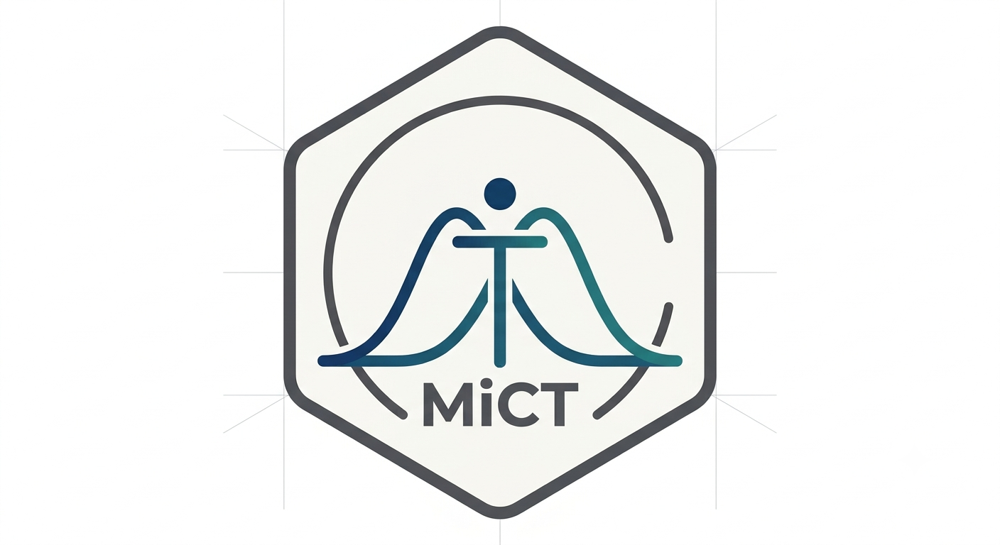

  

# MiCT

## Minimal Important Change and Threshold Estimation

`MiCT` provides tools for estimating minimal important change (MIC) and interpretation thresholds 
for multi-item questionnaires and single-item continuous or ordinal measures.
